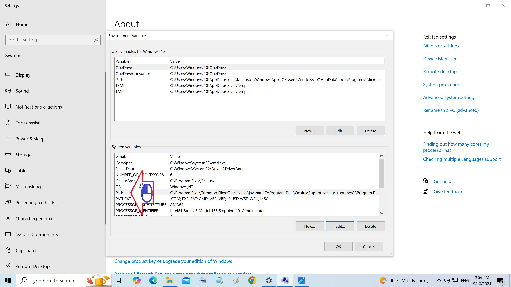
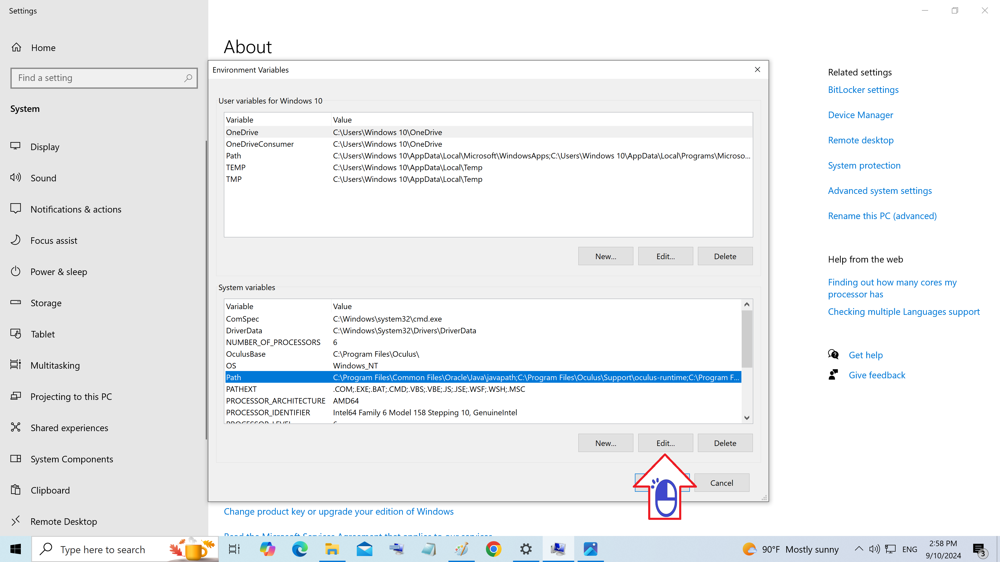
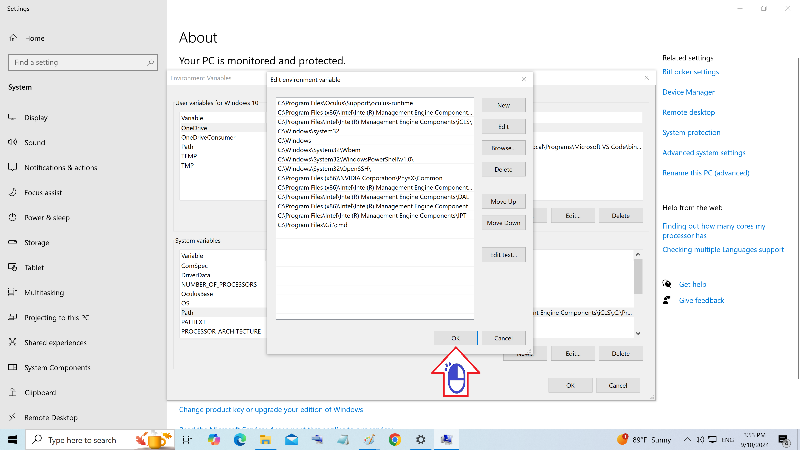
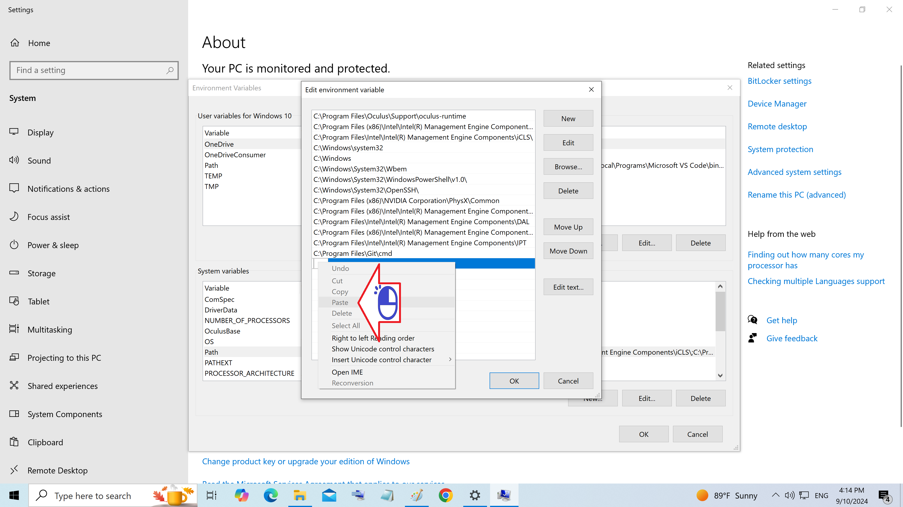
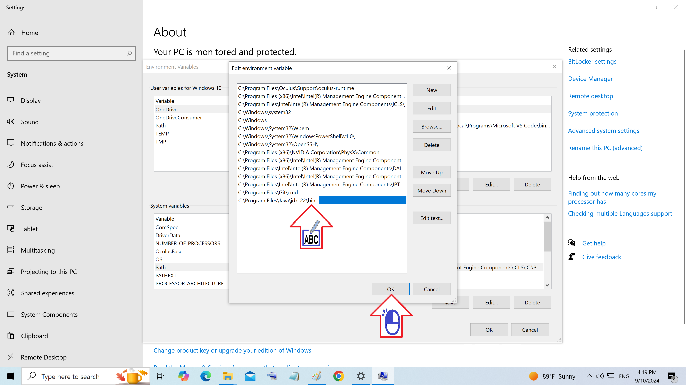

# Windows システム レジストリ

システムレジストリにアクセスする方法

絵 01 - 「環境変数」をクリックします

絵 02 - クリックパス

絵 03 - 「Edit」をクリックします

絵 04 - Oracle 標準リファレンスをクリックします

絵 05 - 「削除」をクリックします

絵 06 - 「OK」をクリックします

絵 07 - 「New」をクリックします

絵 08 - バーを右クリックします

絵 09 - 「Paste」をクリック

絵 10 - JDKパス

絵 11 - 「bin」を追加して「OK」をクリックします

絵 12 - 「OK」をクリックします

